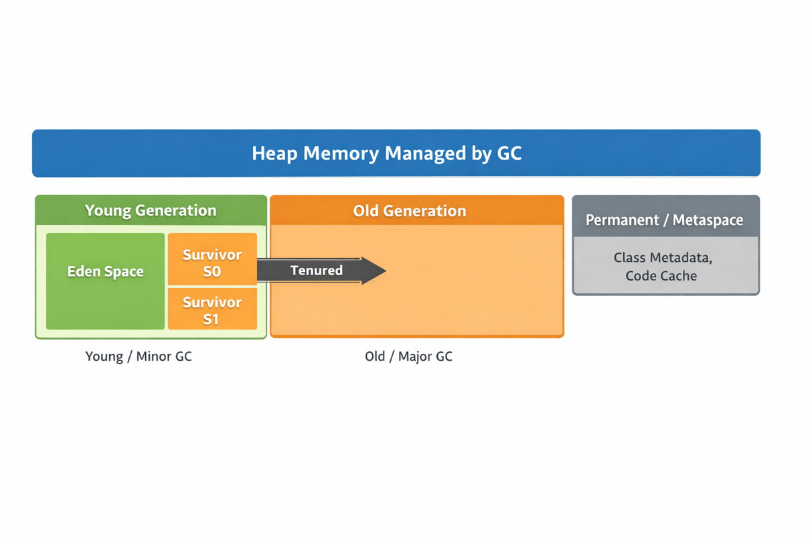

# 10. JVM 이해하기 - 2
## Runtime Data Area (런타임 데이터 영역)

프로그램 실행 중에 사용되는 메모리 영역을 말한다. 런타임 데이터 영역 중 일부는 JVM 시작 시 생성되어 JVM이 종료될 때만 소멸된다. 그리고 이외의 영역은 스레드별로 관리된다. 스레드별 데이터 영역은 스레드가 생성주기를 따른다. 런타임 데이터 영역은 다음과 같이 나뉘어져 있다.

> Run-time Data Area는 JVM이 실행 중에 쓰는 메모리 지도를 표준화한 것
>
- 스레드 공유(Shared)
    - Heap
    - 메서드 영역(Method Area)
- 스레드 전용(Per-thread)
    - PC 레지스터
    - JVM 스택
    - 네이티브 메서드 스택
        - 런타임 상수 풀

### PC Register (Thread 전용)

PC Register는 각 스레드가 현재 실행 중인 바이트코드의 주소를 가리키는 포인터 역할을 한다. 자바 메서드가 실행 중이면 현재 명령어 위치가 들어있다. 또는 네이티브 메서드가 실행 중이라면 값이 Undefined로 취급된다.

PC Register가 필요한 이유는 스레드가 동시에 다른 바이트코드 위치를 실행하니까 현재 위치를 스레드별로 보관해야 Context Switching, 예외 처리와 같은 동작을 할 수 있다.

### JVM Stack (Thread 전용)

스레드마다 하나의 스택을 가지고 있고, 메소드 호출마다 Stack Frame이 push/pop 된다. JVM Stack은 C언어의 스택과 유사하며, 지역 변수와 부분 결과를 저장하고 메소드 호출 및 반환에 관여한다.

- JVM 스택은 프레임을 푸시하고 팝하는 작업 외에는 직접 조작되지 않으므로 프레임은 힙 영역에 할당될 수 있다.
  → 프레임을 힙에 객체처럼 할당해두고 프레임 객체를 가리키는 포인터를 스택에 저장할 수 있다는 의미
  → JVM 스택/프레임은 추상 개념이고, 구현은 자유다.
- JVM 스택에 사용되는 메모리는 연속적일 필요가 없다.
- 프로그래머 또는 사용자가 JVM 스택의 초기 크기를 제어할 수 있는 기능을 제공하고 또한 최대 및 최소 크기를 제어할 수 있는 기능을 제공한다.
- JVM 스택 예외
    - StackOverflowError
    - OutofMemoryError
        - JVM이 스택을 동적으로 확장했지만 메모리가 부족한 경우, 새 스레드에 초기 스택을 생성하는데 메모리가 부족한 경우 예외 발생

### Native Method Stack (Thread 전용)

JNI로 C/C++ 같은 네이트 코드를 호출할 때 쓰는 스택 영역이다.

- 자바 스택과 별개로 관리 될 수 있다.
- 네이티브 쪽에서 메모리 누수/스택 오버플로우/크래시가 나면 JVM이 같이 죽을 수 있다.
- 네이티브 메서드를 로드할 수 없거나 기존 스택(C 스택)에 의존하지 않는 JVM 구현체는 네이티브 메서드 스택을 제공할 필요가 없다.
- 네이티브 메서드 스택 예외
    - StackOverflowError
    - OutOfMemoryError

### Heap

힙은 가상 머신 시작시 생성되고, 모든 클래스 인스턴스와 배열에 필요한 메모리가 할당되는 영역이다. 객체에 할당된 힙 공간은 GC에 의해 회수되며, 객체는 명시적으로 할당 해제되지 않는다.

- JVM 명세는 GC 알고리즘을 강제하지 않는다. GC는 JVM 구현과 실행 옵션으로 선택할 수 있다.

  → GC 최적화 옵션들

- 힙에 할당되는 메모리는 연속적일 필요가 없다.
- 힙 예외
    - OutOfMemoryError
        - 계산에 필요한 힙 크기가 GC에서 제공하는 것보다 크면 JVM은 예외를 발생시킨다.

**Heap 할당 되는 것**

- 대부분의 객체 인스턴스
- 배열(primitive 배열 포함)
- 큰 객체, 문자열 등은 특별 취급될 수 있다.

**Heap과 관련된 대표 이슈**

- OutOfMemoryError
- GC pause(STW) : Throughput/Latency 트레이드 오프
- 메모리 누수(객체가 참조 연결되어 회수 못함)

### Method Area

메소드 영역은 가상 머신 시작시 생성된다. 논리적으로 힙의 일부이지만, 간단한 구현에서는 GC나 압축을 수행을 하지 않을 수 있다.

메소드 영역에 할당되는 데이터는 다음과 같다.

- 클래스 구조 정보(필드/메소드 정보)
- 런타임 상수 풀
- static 변수
- 메소드 바이트 코드

HotSpot은 Java8부터는 PermGen 대신 Metaspace를 사용한다.

- 클래스 메타데이터가 네이티브 메모리에 저장된다.
- 클래스 로더 누수는 대게 메타데이터가 계속 불러나는 걸로 관측된다.
- 예외
    - OutOfMemory : 메소드 영역의 메모리가 할당 요청을 충족할 만큼 확보되지 않으면 발생

### Run-Time Constant Pool

클래스 파일의 Constant Pool이 런타임에 로드 되면 런타임 상수 풀이 된다.

- 리터럴(문자열 등)
- 클래스/메소드/필드의 심볼 참조
- 동적 호출 정보(invokedynamic 관련)
- 링크 단계 중 “해결” 단계 에서 심볼 참조가 실제 참조로 연결되는 과정이 이 풀과 연관되어 있다.

### OOM 메세지

- OutOfMemoryError : Java Heap space → Heap(객체/배열) 부족
- OutOfMemoryError : Metaspace → Metaspace 부족 or 클래스 로더 누수 의심
- OutOfMemoryError : Compressed class space → Class space 부족 가능
- Code Cache 부족
    - JIT 코드가 쌓여 Code Cache pressure

## Garbage Collector (Heap)

힙 메모리 영역에 있는 객체들 중에 더 이상 도달할 수 없는 객체들을 탐색 후 회수하거나 정책과 힙 상태에 따라 메모리 관리를 수행한다.

> 도달할 수 없는 객체란?
>
- GC Root(스레드 스택, static, JNI 등)에서 시작해 참조 그래프를 따라가며 도달 가능한 객체를 말한다.
- 그래서 이 그래프를 통해 도달할 수 없는 객체들은 회수를 시작한다.(unreachable)
- 정책/목표 : JVM 구현체에 따라 다르지만 보편적으로 처리량, 지연시간, 힙 단편화, 세대별(Young, Old) 규칙을 적용

즉, GC는 객체가 어딘가에 참조가 남아 있지만 루트에서 닿지 않으면 회수 대상으로 여긴다.

> 메모리 관리란?
>
- GC는 힙에 할당된 이후, 수집 과정에서 살아남은 객체를 세대 등의 규칙에 따라 다른 영역으로 이동 시키거나, 필요시 압축을 수행해 메모리를 정리한다.

  그래서 GC가 관리하는 힙 메모리는 구역이 나뉘어져 있고, 각 구역마다 할당 규칙이 있다.

### GC Heap 메모리 구조

- **Yong Generation**
    - Eden : 새 객체가 대부분 여기 생성된다.
    - Survivor S0/S1 : Minor GC에서 살아남은 객체가 번갈아 이동한다.
    - 이 영역은 새로운 객체가 할당되거나 할당된지 얼마 지나지 않은 객체들이 할당되어있는 영역이다. Young에는 Eden, Survivor S0,S1 두 영역이 있는데 Eden이 새로운 객체가 할당되는 영역이고, Eden이 가득차면(Minor GC) Survivor S0 또는 S1 영역으로 이동한다. 이를 묶어서 Young이라고 부른다.
- **Old Generation**
    - 오래 살아남은 객체가 Old 영역으로 이동된다.
    - Survivor 영역까지 가득찬다면 GC는 Major GC를 실행시켜 살아남은 객체들을 Old 영역으로 위치시킨다. Old는 오래 살아남은 객체들이 저장되는 영역이다.
- **Minor GC**
    - 주로 Young 영역 수집
- **Major GC**
    - Old 영역 중심 수집
- **Metaspace**
    - 클래스 메타데이터(클래스/메소드/필드 구조, 상수풀 메타 등) 저장
    - PermGen : Java 7까지 존재. 힙 내부 영역에 위치해서 튜닝이 까다로웠음
    - Heap 외부의 영역

## GC 수집 동작 과정

GC는 세대별(Young/Old)로 수집하는 과정이 차이가 있다. Young 영역에서 일어나는 GC를 Minor GC, Old 영역은 Major GC라고 한다. 그리고 Young, Old, Metaspace 영역까지 힙 전체를 정리하는 무거운 작업을 Full GC라고 한다.

### GC가 동작하게 되는 기준

Old에 단편화가 심한가, GC가 Region 기반인가, 연속 세대 기반인가, 지연시간이 엄격한가, 살아있는 객체 비율이 높은가의 기준으로 판단할 수 있다.

- 단편화가 심하게 되면 단편화 제거가 시급하기 때문에 압충 또는 이동이 필요하다.
- Region 기반이면 기본이 이동/재배치이고 연속 세대 기반이면 기본이 압축이다.
- 지연시간이 엄격하면 회수 동시에 이동/재배치가 이루어진다.
- 지연시간이 엄격하지 않으면 STW 압축도 감수해서 한번에 해결한다.
- 가비지 영역이 많으면 이동/재배치가 효율적이고, 대부분 살아있고 흩어져 있으면 압축이 효율적이다.

### Young 영역 동작 과정

Young 영역에서 Eden 영역이 가득차게 되면 Minor GC가 객체를 수집하게 된다. 그 과정에서 Root Scan시 도달하지 못한 객체는 회수가 되고, 그 이외에 객체들은 Survivor 1,2 중 한곳으로 이동하게 된다. 그리고 그 이후에 Survivor 영역을 번갈아 이동하다가 살아남은 객체들은 Old 영역으로 이동하게 된다. 한 가지 주의할 것은 Young GC의 이동은 Mark-sweep이 아니라 Copying 방식이다. 또한 Young GC는 수집하기 전에 Old에서 Young으로 들어오는 참조도 같이 반영한다.

이동 과정은 다음과 같다.

1. Root 스캔 + Remembered Set 반영
2. 생존 객체 그래프 트레이싱(도달 가능 판별)
3. 복사 + 포워딩 포인터 설정
    - 포워딩 포인터 : 객체가 이동한 곳 표시
4. 참조 업데이트(포인터 수정)
    - 옮겨진 새 주소로 모든 참조를 바꿈

### Old 영역 동작 과정

Old 영역에서의 객체 수집과정을 보면 Full GC가 오래걸리는 이유를 알 수 있다. Young은 Eden을 통째로 비우는 그림이지만 Old는 살아있는 객체가 많고 흩어져 있기 때문에 과정이 더 무겁다. 그렇기 때문에 회수, 이동 과정 이외에도 압축 또는 재배치 과정이 이루어져야 한다.
Old GC는 크게 4단계로 이루어져 있다.

1. Mark (표시)
2. Reclaim (회수)
3. Compact 또는 Evacuate (압축 또는 이동)
4. Reference Update (참조 수정)

Old 영역은 구현체마다 Old 영역 수집 알고리즘이 다르다.

**A) Serial / Parallel Old (처리량 우선, 단순)**

- Old 수집: **Mark–Sweep–Compact**(대체로 STW)
- 장점: 단순, 처리량 좋을 수 있음
- 단점: 힙 크면 pause가 길어짐

(즉, Old를 “한 번에 크게 멈춰서” 정리)

**B) CMS (예전의 저지연 전략, 현재는 역사적)**

- Old 수집: **Concurrent Mark + Sweep**
- 장점: pause 줄이려고 “마킹을 동시에” 함
- 단점: **압축(compaction)이 기본이 아니라 단편화**가 누적 → Full GC로 튈 수 있음

(요점: 동시 마킹은 했지만 “단편화 해결”이 약했음)

**C) G1 (Region 기반, Old를 “조금씩”)**

- Old는 “고정 구역”이 아니라 **Old 역할을 가진 여러 Region**
- Old 수집은 **Mixed GC**가 핵심:
    - Young 수집할 때 **일부 Old region도 같이 evacuation(살아있는 객체 이동 후 회수)**
- 마킹은 **Concurrent Marking**
- 장점: Old를 통째로 미는 대신 나쁜 region부터 조금씩 치움
- 단점: 상황에 따라 **evacuation 실패 → Full GC** 가능

(요점: Old를 ‘선별적으로’ 치우고, 이동으로 단편화도 완화)

**D) ZGC / Shenandoah (최신 저지연, 이동도 동시)**

- Old 수집: **Concurrent Mark + Concurrent Relocation(이동)**
- 장점: 힙이 커도 pause를 매우 짧게 유지하는 목표
- 핵심 기술: **읽기/쓰기 장벽(load barrier 등)으**로 포인터 업데이트를 동시 수행
- 단점: 장벽 비용/환경 제약 등(일반적으로 CPU 오버헤드 trade-off)

## 출처

---

https://docs.oracle.com/javase/specs/jvms/se25/html/jvms-2.html#jvms-2.5

https://junhyunny.github.io/information/java/what-is-jvm/

https://mangkyu.tistory.com/301

https://d2.naver.com/helloworld/1230