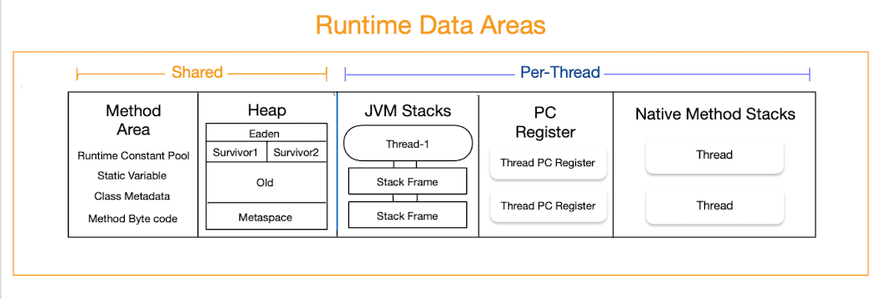
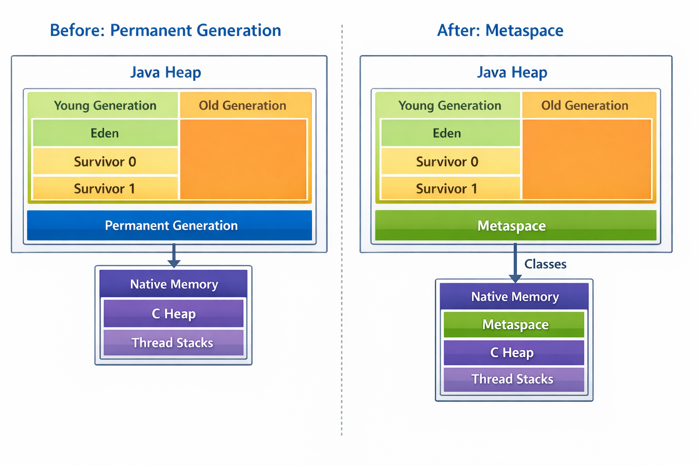
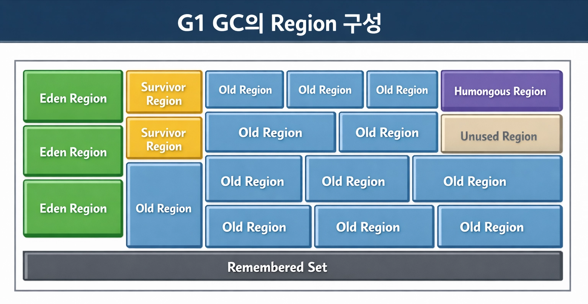

# 10. JVM 이해하기 - 2 (정리중)
## Runtime Data Area (런타임 데이터 영역)

프로그램 실행 중에 사용되는 메모리 영역을 말한다. 런타임 데이터 영역 중 일부는 JVM 시작 시 생성되어 JVM이 종료될 때만 소멸된다. 그리고 이외의 영역은 스레드별로 관리된다. 스레드별 데이터 영역은 스레드가 생성주기를 따른다. 런타임 데이터 영역은 다음과 같이 나뉘어져 있다.

> Run-time Data Area는 JVM이 실행 중에 쓰는 메모리 지도를 표준화한 것
>
- 스레드 공유(Shared)
  - Heap
  - 메서드 영역(Method Area)
- 스레드 전용(Per-thread)
  - PC 레지스터
  - JVM 스택
  - 네이티브 메서드 스택
    - 런타임 상수 풀



### PC Register (Thread 전용)

PC Register는 각 스레드가 **현재 실행 중인 바이트코드의 주소를 가리키는 포인터 역할**을 한다. 자바 메서드가 실행 중이면 현재 명령어 위치가 들어있다. 또는 네이티브 메서드가 실행 중이라면 값이 Undefined로 취급된다.

**저장되는 값**

- 현재 실행 중인 JVM 바이트코드 주소 (instruction address)

**특징**

- 스레드마다 하나씩 존재
- 네이티브 메서드 실행 시 undefined 상태
- 매우 작은 메모리

PC Register가 필요한 이유는 스레드가 동시에 다른 바이트코드 위치를 실행하니까 현재 위치를 스레드별로 보관해야 Context Switching, 예외 처리와 같은 동작을 할 수 있다.

### JVM Stack (Thread 전용)

스레드마다 하나의 스택을 가지고 있고, 메소드 호출마다 Stack Frame이 push/pop 된다. JVM Stack은 C언어의 스택과 유사하며, 지역 변수와 부분 결과를 저장하고 메소드 호출 및 반환에 관여한다.

**저장되는 값**

- 각 메서드 호출마다 Stack Frame 생성
  - Stack Frame 내부 구성
    - Local Variables
    - Operand Stack (연산용 스택)
    - Frame data (return address 등)

**특징**

- JVM 스택은 프레임을 푸시하고 팝하는 작업 외에는 직접 조작되지 않으므로 프레임은 힙 영역에 할당될 수 있다.
  → 프레임을 힙에 객체처럼 할당해두고 프레임 객체를 가리키는 포인터를 스택에 저장할 수 있다는 의미
  → JVM 스택/프레임은 추상 개념이고, 구현은 자유다.
- 프로그래머 또는 사용자가 JVM 스택의 초기 크기를 제어할 수 있는 기능을 제공하고 또한 최대 및 최소 크기를 제어할 수 있는 기능을 제공한다.
- JVM 스택 예외
  - StackOverflowError
  - OutOfMemoryError
    - JVM이 스택을 동적으로 확장했지만 메모리가 부족한 경우, 새 스레드에 초기 스택을 생성하는데 메모리가 부족한 경우 예외 발생

### Native Method Stack (Thread 전용)

JNI로 C/C++ 같은 네이트 코드를 호출할 때 쓰는 스택 영역이다.

**저장되는 값**

- C, C++ 등 JNI 네이티브 메소드 실행 정보

```java
System.currentTimeMillis(); // 내부는 native
```

**특징**

- 자바 스택과 별개로 관리 될 수 있다.
- 네이티브 쪽에서 메모리 누수/스택 오버플로우/크래시가 나면 JVM이 같이 죽을 수 있다.
- 네이티브 메서드를 로드할 수 없거나 기존 스택(C 스택)에 의존하지 않는 JVM 구현체는 네이티브 메서드 스택을 제공할 필요가 없다.
- 네이티브 메서드 스택 예외
  - StackOverflowError
  - OutOfMemoryError

### Heap

힙은 가상 머신 시작시 생성되고, 모든 클래스 **인스턴스**와 **배열**에 필요한 메모리가 할당되는 영역이다. 객체에 할당된 힙 공간은 GC에 의해 회수되며, 객체는 명시적으로 할당 해제되지 않는다.

**저장되는 값**

- 모든 객체 인스턴스(Object)
- 배열(primitive 배열 포함)

**특징**

- JVM 명세는 GC 알고리즘을 강제하지 않는다. GC는 JVM 구현과 실행 옵션으로 선택할 수 있다.

  → GC 최적화 옵션들

- 힙 예외
  - OutOfMemoryError
    - 계산에 필요한 힙 크기가 GC에서 제공하는 것보다 크면 JVM은 예외를 발생시킨다.

**Heap과 관련된 대표 이슈**

- OutOfMemoryError
- GC pause(STW) : Throughput/Latency 트레이드 오프
- 메모리 누수(객체가 참조 연결되어 회수 못함)

### Method Area

메소드 영역은 가상 머신 시작시 생성된다. 논리적으로 힙의 일부이지만, 간단한 구현에서는 GC나 압축을 수행을 하지 않을 수 있다.

**저장되는 값**

- 클래스 구조 정보(필드/메소드 정보)
- 런타임 상수 풀
- static 변수
- 메소드 바이트 코드

HotSpot은 Java8부터는 PermGen 대신 Metaspace를 사용한다.

- 클래스 메타데이터가 네이티브 메모리에 저장된다.
- 클래스 로더 누수는 대게 메타데이터가 계속 불어나는 걸로 관측된다.
- 예외
  - OutOfMemory : 메소드 영역의 메모리가 할당 요청을 충족할 만큼 확보되지 않으면 발생

### Run-Time Constant Pool

클래스 파일의 Constant Pool이 런타임에 로드 되면 런타임 상수 풀이 된다.

- 리터럴(문자열 등)
- 클래스/메소드/필드의 심볼 참조
- 동적 호출 정보(invoke dynamic 관련)
- 링크 단계 중 “해결” 단계 에서 심볼 참조가 실제 참조로 연결되는 과정이 이 풀과 연관되어 있다.

### OOM 메세지

- OutOfMemoryError : Java Heap space → Heap(객체/배열) 부족
- OutOfMemoryError : Metaspace → Metaspace 부족 or 클래스 로더 누수 의심
- OutOfMemoryError : Compressed class space → Class space 부족 가능
- Code Cache 부족
  - JIT 코드가 쌓여 Code Cache pressure

### Heap 메모리 구조


Java Heap에는 메모리 해제를 위한 어떤 Java Code나 Bycode도 존재하지 않는다. Memory를 할당하는 Instruction만 존재한다.

- Heap 영역에 메모리 해제는 GC를 통해서만 수행된다.
- JVM 스펙(Specification)은 이러한 원칙을 강하게 제시하고, 구현을 담당한 JVM 벤더(Oracle, IBM)등은 최대한 이를 따른다.
- 그러나 이것은 원칙일 뿐 어떻게 구현하는 지에 대해서는 전적으로 벤더들에게 일임한다.

> Instruction
JVM이 Heap에 실제 객체 메모리를 확복하도록 지시하는 바이트 코드 명령어
- **new, newarray, anewarray, nultianewarray**
>
- **Yong Generation**
  - Eden : Object가 Heap에 최초로 할당되는 장소
  - Survivor S0/S1 : Eden 영역에서 살아남은 Object들이 잠시 머무르는 곳. 두 영역으로 나뉘어져 있고, 두 영역 중 하나의 Survivor로 이동하게 된다.
  - Minor GC : Eden에 새로운 객체가 할당되고 얼마 지나지 않아 Eden 영역이 가득차게 되면 Object의 참조 여부를 확인해 참조가 유지되는 Live Object이면 Survivor영역으로 넘기고, 참조가 끊긴 GC 수집 대상이면 남겨 둔다. 그리고 Live Object가 Survivor로 모두 넘어가게 되면, 남아있는 Object 모두 청소(Scavenge)한다. 이러한 과정을 Minor GC라고 한다.
- **Old Generation (Tenured Generation)**
  - 오래 살아남은 객체가 Old 영역으로 이동된다. Old 영역에 들어온 객체들은 오랫동안 참도가 되어 있고, 앞으로도 계속 사용될 확률이 높은 Object들을 저장하는 영역이다.
    - 오래 살아남은 객체란 애플리케이션에서 특정 회수 이상 참조되어 기준 Age를 초과한 Object를 말한다.
  - Old 영역의 메모리도 충분하지 않으면 GC가 발생하는데 이를 Full GC(Major GC)라고 한다.
- **Permanent**
  - Perm 영역은 Class의 Meta 정보나 Method의 Meta 정보, Static 변수와 상수 정보들이 저장되는 공간이다.
  - 원래는 Heap 공간에 있었는데, Java 8 부터 Native 영역으로 이동하여 Metaspace 영역으로 변경되었다.
- **Minor GC**
  - 주로 Young 영역 수집
- **Major GC**
  - Old 영역 중심 수집
- **Metaspace**
  - 클래스 메타데이터(클래스/메소드/필드 구조, 상수풀 메타 등) 저장
  - PermGen : Java 7까지 존재. 힙 내부 영역에 위치해서 튜닝이 까다로웠음
  - Heap 외부의 영역에 위치

### Metaspace와 Permanent

Perm과 Metaspace의 변경 사항



| 구분 | 상세 구분 | ~ Java 7 | Java 8 |
| --- | --- | --- | --- |
| 저장 정보 | Class Meta 정보 | 저장 | 저장 |
|  | Method Meta 정보 | 저장 | 저장 |
|  | Static Object 변수, 상수 | 저장 | Heap 영역으로 이동 |
| 관리 포인트 | 메모리 관리 (튜닝) | Heap 영역 튜닝외에 Perm 영역 별도 튜닝 | Heap 영역 튜닝, Native 영역 동적 조정 |
| GC 측면 | GC 수행 대상 | Full GC 수행 대상 | Full GC 수행 대상 |
| 메모리 측면 | 메모리 크기(옵션) | -XX:PermSize
-XX:MaxPermSize | -XX:MetassapceSize
-XX:MaxMetaspaceSize |
- Metaspace 영역은 Native 메모리로 취급되기 때문에 기본적으로 JVM에 의해 크기가 강제되지 않는다.
- 옵션을 통해 제한이 가능하다.
- Metasapce 영역은 필요에 따라 자동적으로 증가한다.

## Garbage Collector

GC는 메모리 공간이 부족해지면 수행하게 된다. 새로운 Object의 할당을 해야 하는데 Heap 공간이 부복하다면, 할당된 Object들 중 더 이상 참조되지 않은 객체들을 회수하고 그 공간을 재활용려는 목적으로 수행되는 것이다.

> 참조되지 않은 객체란?
>
- GC Root(스레드 스택, static, JNI 등)에서 시작해 참조 그래프를 따라가며 도달 가능한 객체를 말한다.
- 그래서 이 그래프를 통해 도달할 수 없는 객체들은 회수를 시작한다.(unreachable)
- 정책/목표 : JVM 구현체에 따라 다르지만 보편적으로 처리량, 지연시간, 힙 단편화, 세대별(Young, Old) 규칙을 적용

즉, GC는 객체가 어딘가에 참조가 남아 있지만 루트에서 닿지 않으면 회수 대상으로 여긴다.

> 메모리 관리란?
>
- GC는 힙에 할당된 이후, 수집 과정에서 살아남은 객체를 세대(Generational Collection) 등의 규칙에 따라 다른 영역으로 이동 시키거나, 필요시 압축을 수행해 메모리를 정리한다.

## GC 수집 동작 과정

GC는 세대별(Young/Old)로 수집하는 과정이 차이가 있다. Young 영역에서 일어나는 GC를 Minor GC, Old 영역은 Major GC라고 한다. 그리고 Young, Old, Metaspace 영역까지 힙 전체를 정리하는 무거운 작업을 Full GC라고 한다.

### Young 영역 동작 과정

Young 영역에서 Eden 영역이 가득차게 되면 Minor GC가 객체를 수집하게 된다. 그 과정에서 Root Scan시 도달하지 못한 객체는 남아있게 되고, 그 이외에 객체들은 Survivor 1,2 중 한곳으로 이동하게 된다. 한 가지 주의할 것은 Young GC의 이동은 Mark-sweep이 아니라 Copying 방식이다. 또한 Young GC는 수집하기 전에 Old에서 Young으로 들어오는 참조도 같이 반영한다.

이동 과정은 다음과 같다.

1. Root 스캔 + Remembered Set 반영
2. 생존 객체 그래프 트레이싱 (도달 가능 판별)
3. 복사 + 포워딩 포인터 설정
  - 이때 Survivor 영역으로 이동
  - 포워딩 포인터 : 객체가 이동한 곳 표시
4. 참조 업데이트(포인터 수정)
  - 옮겨진 새 주소로 모든 참조를 바꿈
5. Eden 영역 통째로 Sweep

### Old 영역 동작 과정

Old 영역에서의 객체 수집과정을 보면 Full GC가 오래걸리는 이유를 알 수 있다. Young은 Eden을 통째로 비우는 그림이지만 Old는 살아있는 객체가 많고 흩어져 있기 때문에 과정이 더 무겁다. 그렇기 때문에 회수, 이동 과정 이외에도 압축 또는 재배치 과정이 이루어져야 한다.
Old GC는 크게 4단계로 이루어져 있다.

1. Mark (표시)
2. Reclaim (회수)
3. Compact 또는 Evacuate (압축 또는 이동)
4. Reference Update (참조 수정)

Old 영역은 구현체마다 Old 영역 수집 알고리즘이 다르다.

### Root Set

참조 그래프를 Tracing하여 Reachable Object를 판별한다.

**Reachable Object 참조 조건**

1. Local Variable Section, Operand Stack 에 Object 의 Reference 정보가 있을 경우
2. Method Area에 로딩된 클래스 중 constant pool에 있는 Reference 정보를 토대로 Thread 에서 직접 참조하지 않지만 Constant pool을 통해 간접 link를 하고 있는 경우
3. 아직 메모리에 남아 있으며 Native Method Area로 넘겨진 Object의 Reference가 JNI 형태로 참조 관계가 있는 경우

## Hotspot JVM의 GC

**Hotspot JVM의 GC 메커니즘**

1. Object는 생성된 후 금방 Garbage가 된다.(High infantmotality)
2. Older Object가 Younger Object를 참조할 일은 드물다.

Hotspot JVM의 GC 메커니즘은 경험적 기반에 의해 세워진 가설들이라 볼 수 있다.

첫번째 가설은 새로 할당된 Object가 모인 곳은 단편화 발생 확률이 높다고 판단된다. 그래서 Compaction 작업을 해야하기 때문에 Eden Area를 만들게 됐고, GC 시 Live Object들을 피신시키는 Survivor Area를 따로 구성한 것이다.

GC시 Live Object를 판별하는 Marking 작업을 하게 되는데, 이는 거의 Young영역에서만 수행된다. 전체 Heap에 대해 수행하게 되면 긴 Suspend Time을 가져가게 되기 때문이다. 그런데 만약, Older에서 Young 영역에 있는 객체를 참조하게 된다면 Marking 작업이 Old 영역까지 이어져 Suspend Time 길어진다. 이러한 경우를 대비해서 Hotspot JVM은 Card Table이란 장치를 마련했다.

### Card Table

Old 영역의 메모리를 대표하는 별도 메모리 구조이다. 만약 Young 영역에 Object를 참조하는 Old 영역 Object가 있다면 Old 영역 Object 시작주소에 일종의 Flag(Dirty)를 표시하고 해당 내용을 Card Table에 기록한다. 즉, 참조가 있다면 Card Table을 보고 빠르게 관계를 파악할 수 있게 한 것이다.

- Card 메모리 : Old Area 메모리 512bytes 당 1byte의 공간을 차지

### TLAB(Thread-Local Allocation Buffers)

TLAB는 메모리 할당 작업을 할 때 쓰레드별로 주어지는 Local Buffer이다.
TLAB는 GC가 발생하거나 객체가 각 영역에 다른 영역으로 이동할 때 애플리케이션의 병목이 발생하는데 이를 통해 다른 스레드에 영향을 주지 않는 메모리 할당 작업을 가능하게 한다.

### GC 종류

### Seral Collector

- Young / Old Generation 모두 Serial로 Single CPU를 사용한다.
- Client Class의 기본 Collector 이며 현재 거의 사용되지 않는 Collector이다.

### Parallel Collector

Young영역에서 컬렉션을 병렬 처리를 하는 GC이다. 즉, Multi Thread가 동시에 GC를 수행한다.

- throughput collector라고도 한다.
- 다른 CPU가 대기 상태로 남아있는 것을 최소화하는 것을 목표로 한다.
- 많은 CPU가 사용되지만, GC의 부하를 줄이고 애플리케이션 처리량을 증가시킬 수 있다.
- Server Class의 JVM에서 기본 Collector이다.

Eden, Survivor 영역의 Copy 작업을 여러 Thread가 동시 수행한다. 투입한 Resource 만큼 Suspend Time을 단축할 수 있다. 하지만, Multi Thread인 만큼 Corruption이 발생하는데, Hotspot은 이를 PLAB이라는 Promotion Buffer를 마련해 해결하고 있다.

> PLAB(Parallel Allocation Buffer)
GC Thread가 Promotion시 사용하는 버퍼이다. Old 영역의 일정부분을 할당 받고 사용 후 다시 Buffer를 재할당한다.
>

### CMS Collector

CMS Collector는 Suspend Time을 분산하여 응답시간을 개선한다.

- low-latency Collector로도 알려져 있다.
- 힙 메모리 영역의 크기가 클 때 적합하다.
- GC의 Pause Time을 줄이는 목적이 있다.
- Young Area에는 Parallel Copy 알고리즘, Old Area는 Concurrent Mark-Sweep 알고리즘이 사용된다.

**Old Area - Concurrent Mark-sweep 알고리즘**

Initial Mark Phase - Concurrent Mark Phase - Remark Mark Phase - Concurrent Sweep Phase 단계를 거친다.

- Initial Mark Phase
  - Single Thread만 사용
  - 애플리케이션이 중지된다.
  - 애플리케이션에서 직접 참조되는 Object만 Mark한다.
  - Suspend 상태지만 빠르다.
- Concurrent Mark Phase
  - Single Thread만 사용
  - 애플리케이션 수행
  - GC Thread 외 Working Thread는 애플리케이션 수행이 가능하다. Initial Mark phase에서 선별된 Live Object가 참조하고 있는 Object를 추적해 Mark 한다.
- Remark Phase
  - Multi Thread 사용
  - 애플리케이션 중지
  - 이미 Marking 된 Object 다시 추적해 Live 여부를 확정한다.
  - 모든 Resource 투입
- Concurrent Sweep Phase
  - Single Thread만 사용한다.
  - 애플리케이션 수행
  - 확정된 Live Object를 제외한 Object를 지운다.
  - Compaction 작업은 수행하지 않는다.
    - Compaction 작업은 Heap의 Suspend를 유발
  - 반복된 Sweep으로 발생한 단편화는 Free List를 사용하여 줄이려고 한다.

> Free List
Old Area의 현재 사용가능한 빈 공간 목록. 승격된 Object에 맞는 크기를 Free List에서 탐색한다.
또한, Object 사이즈를 통계화(평균)하여, Free Memory 블록을 붙이거나 나누는 작업을 수행해 적절한 Size를 유지한다.
>

**CMS Collector의 문제**

Floating Garbage 문제

Initial Mark이 Live Object를 판별한 후 Concurrent Mark 단계에서 Old 영역에 승격되어 들어와 Dead Object임에도 불구하고 GC 수행 판별 여부 대상에 포함되지 않아 회수되지 않은 Dead Object를 말한다.

이는 Old Area를 확장하게 만다는 요인이 된다.

이외의 문제

- CMS Collector는 Suspend Time을 완벽하게 없애지 못한다. Young Area GC와 Remark phase를 연달아 수행하면 의도한 Suspend Time보다 길어질 수 있다. 그래서 CMS는 Collection에서 Schedule을 고려한다.

**Old Area - Parallel Compaction 알고리즘**

### G1 Collector



**G1 Collector GC 메커니즘**

- G1 Collector는 물리적으로 Generation 구분을 없애고, Region이라는 영역으로 전체 Heap을 균등하게 1Mbytes 단위로 나눠서 관리하게 된다.
- Garbage First라는 의미는 Garbage로만 꽉 찬 Region부터 Collection을 시작한다는 의미로 발견 즉시 바로 Collection 한다.
- Region은 물리적 개념으로 Young Area는 Object가 Allocation Region의 집합, Promotion 되는 Region의 집합을 Old Area라고 한다.
- Remember set은 Region 외부에서 들어오는 참조 정보를 가진다. G1은 Remember set을 가지고 Region 내에 참조를 관리한다. 이로 인해 Marking 작업 효율을 높일 수 있다.

**Garbage First Collection**

1. Evacuation Pause (Young GC)
   Young Region(Eden + Survivor)에서 살아있는 객체를 다른 Region으로 복사하고, 비워진 Region을 재사용 가능 상태로 만드는 STW 단계
2. Concurrent Mark - Marking
   애플리케이션 실행과 동시에 Old Region 전체를 대상으로 살아있는 객체를 추적하여 힙의 생존 객체 분포를 계산하는 단계
3. Current Mark - Remarking
   Concurrent Mark 중 변경된 객체 참조를 최종 반영하기 위해 짧게 STW로 정확한 생존 객체 집합을 확정하는 단계
4. Old Region Reclaim - Remarking
   마킹 경과를 기반으로 회수 가치가 높은 Old Region을 선별하고, 완전히 비어있는 Region을 즉시 해제하는 단계
5. Old Region Reclaim - Evacuation Pause
   Young Region과 일부 Old Region을 함께 Evacuation하여, 회수 대상 Old 객체를 다른 Region으로 이동시키고 해당 Region을 비우는 STW 단계
6. Compaction Phase
   객체를 연속된 Region으로 재배치하여 단편화를 제거하고, 큰 연속 메모리 블록을 확보하는 정리 단계
   Concurrent 작업을 수행한다.

>
>
>
> G1은
> 👉 Young만 정리 →
> 👉 전체 Old 생존 분석 →
> 👉 회수 가치 높은 Old만 선택 →
> 👉 점진적으로 회수 →
> 👉 필요 시 Compaction
>

### 정리

**A) Serial / Parallel Old (처리량 우선, 단순)**

- Old 수집: **Mark–Sweep–Compact**(대체로 STW)
- 장점: 단순, 처리량 좋을 수 있음
- 단점: 힙 크면 pause가 길어짐

(즉, Old를 “한 번에 크게 멈춰서” 정리)

**B) CMS (예전의 저지연 전략, 현재는 역사적)**

- Old 수집: **Concurrent Mark + Sweep**
- 장점: pause 줄이려고 “마킹을 동시에” 함
- 단점: **압축(compaction)이 기본이 아니라 단편화**가 누적 → Full GC로 튈 수 있음

(요점: 동시 마킹은 했지만 “단편화 해결”이 약했음)

**C) G1 (Region 기반, Old를 “조금씩”)**

- Old는 “고정 구역”이 아니라 **Old 역할을 가진 여러 Region**
- Old 수집은 **Mixed GC**가 핵심:
  - Young 수집할 때 **일부 Old region도 같이 evacuation(살아있는 객체 이동 후 회수)**
- 마킹은 **Concurrent Marking**
- 장점: Old를 통째로 미는 대신 나쁜 region부터 조금씩 치움
- 단점: 상황에 따라 **evacuation 실패 → Full GC** 가능

(요점: Old를 ‘선별적으로’ 치우고, 이동으로 단편화도 완화)

**D) ZGC / Shenandoah (최신 저지연, 이동도 동시)**

- Old 수집: **Concurrent Mark + Concurrent Relocation(이동)**
- 장점: 힙이 커도 pause를 매우 짧게 유지하는 목표
- 핵심 기술: **읽기/쓰기 장벽(load barrier 등)으**로 포인터 업데이트를 동시 수행
- 단점: 장벽 비용/환경 제약 등(일반적으로 CPU 오버헤드 trade-off)

## IBM JVM Collector

### Throughput 최적화 Collector

### Response Time 최적화 Collector

### Generational Concurrent Collector

### Sub Pool Collector

---

## Flab AI 질의응답

- 1. **JVM의 메모리 구조와 GC(가비지 컬렉션) 기전, 그리고 GC 튜닝 시 고려해야 할 주요 파라미터와 그 영향에 대해 설명하세요.**

JVM 메모리 구조는 Runtime Data Area라고 하는데, 보통 Thread 영역과 Non-Thread 영역으로 나뉜다. Thread 영역은 각 쓰레드 마다 생성될 때 할당되는 영역으로 JVM Stacks, PC Register, Native Method Stacks 가 있다. Non-Thread 영역은 모든 쓰레드가 공유할 수 있는 영역으로 Method Area, Heap이 있다.

GC는 JVM 메모리 중에 Heap 영역을 관리한다. GC는 Heap에 할당된 객체들을 관리하는데 주로 더 이상 참조 그래프에 도달할 수 없는 객체들을 수집하여 회수하는 작업을 한다. 또한, 그 외에 수집되지 않은 객체들을 정책/목표에 따라서 다른 영역으로 이동시키거나, 필요시 압축 작업을 하게 된다.

GC는 세대라는 규칙을 적용에 메모리 영역을 구분하는데 크게 Yuong/Old 영역이 존재한다. Young 영역에서 Eden이라는 영역이 주로 새로운 객체가 할당되는 영역이다. 그리고 Young 영역이 가득 찼을 때 GC 객체를 탐색해서 회수할 객체들을 찾고 그 외에 나머지들은 Survivor 영역으로 이동시킨다. 그리고 Survivor 영역도 가득찼을 때 오래도록 살아남은 객체들은 Old 영역으로 이동시키게 된다.

이렇게 각 영역이 가득찰때 혹은 어떠한 이유로 객체 회수 및 이동(승격)을 하는 수집 과정이 일어날때는 애플리케이션이 멈춤 현상이 일어난다. 이를 Stop The World(STW)라 한다.

GC 수집이 자주 일어날 경우 STW 시간이 늘어나게 되면 실행 중인 애플리케이션은 사용자 응답 Latency가 길어질 수 밖에 없다. GC 튜닝이란 이 시간을 줄이는 작업을 말한다.

GC 튜닝시 고려해야할 파라미터는 GC는 메모리와 연관되어있으니 메모리 관련 옵션들을 고려해야 한다. 주로 힙 영역 크기를 설정하는 -Xms, -Xmx가 있고 세대 영역의 크기를 설정하는 -XX:NewRatio, -XX:NewSize, -XX:SurivorRatio가 있다.

>
>
> - 답변에 대한 평가 : 80점
> - 평가 이유 : JVM의 메모리 구조와 GC에 대한 전반적인 이해가 잘 되어 있으며, 세대라는 개념과 Young/Old 영역, 그리고 Stop The World 현상에 대한 설명이 상세히 이루어졌습니다. 또한 GC 튜닝시 고려해야 할 주요 파라미터에 대한 설명도 잘 되어 있습니다.
> - 검색 키워드 : JVM Memory Structure, Garbage Collection in Java, GC Tuning Parameters
- 2. 꼬리질문: GC 튜닝에서 세대 크기 비율을 조절하는 -XX:NewRatio 옵션에 대해 좀 더 자세히 설명해보세요.

-XX:NewRatio는 세대 크기 비율을 조절하는 옵션으로 New영역과 Old 영역의 비율을 설정한다. 이 옵션이 어떻게 설정하느냐에 따라 GC 성능에 많은 차이가 발생한다.

-XX:NewRatio=2 로 설정하면 New영역 1 : Old 영역 2로 설정된다.
Old영역 비율이 커지면 GC가 적게 일어나나 속도가 느려진다.
전반적으로 NewRatio값이 2나 3일때의 GC상황이 좋을 수가 있다.

>
>
>
> 답변에 대한 평가 : 90점
>
> - 평가 이유 : -XX:NewRatio 옵션에 대한 설명이 상세히 이루어졌고, 옵션 값에 따라 GC 성능에 어떤 영향을 주는지 잘 설명하였습니다.
> - 검색 키워드 : Java -XX:NewRatio option, Java GC performance tuning with -XX:NewRatio
>
> 꼬리질문: -XX:NewRatio 값이 매우 낮거나 매우 높을 때 어떠한 문제가 발생할 수 있을까요?
>
- 3. -XX:NewRatio 값이 매우 낮거나 매우 높을 때 어떠한 문제가 발생할 수 있을까요?

값이 매우 낮으면 Young영역이 커지므로 GC 발생 횟수가 적어질 수 있다. 하지만, Young 영역의 크기가 커진다는 것은 Minor GC가 발생할 때 탐색해야할 객체들도 그래서 Minor GC가 한번 일어날 때 STW 시간이 늘어날 수 있다. 그리고 Young에서 살아남은 객체들은 결국 Old로 가게 되는데 Old 크기가 작으면 이동될 확률이 적어지고, 또한 Full GC가 자주 일어나게 될 수 있다. 이는 장수 객체가 많은 서비스라면 특히 악화된다.

그렇다고 해서 매우 높은 값을 설정한다고 좋아지는 것은 아니다. . 값을 매우 높게 설정한다면, Young 영역은 작아지고 Old는 매우 커진다. 그렇게 되면 Minor GC가 자주 발생하게 되고, 또한 Young 영역 크기가 작으니 Old영역으로 이동이 빨라져 Old영역도 빨리 타이트해질 가능성이 있다. 또한 FullGC 수집 이벤트가 무거워져 STW 시간도 늘어나게 된다.

>
>
> - 답변에 대한 평가 : 100점
> - 평가 이유 : -XX:NewRatio 값이 매우 낮거나 매우 높을 때 발생할 수 있는 문제에 대해 상세히 설명하였고, 각각의 상황에서의 GC 동작 및 영향을 잘 파악하고 설명했습니다.
> - 검색 키워드 : Java -XX:NewRatio setting effects, Java Garbage Collection tuning with different -XX:NewRatio values
- 4. **JVM의 Young/Old/Metaspace 각각의 역할과 GC가 이들에 미치는 영향은 무엇인가요?**

Young : 이 영역은 새로운 객체가 할당되거나 할당된지 얼마 지나지 않은 객체들이 할당되어있는 영역이다. Young에는 Eden, Survivor 영역이 있는데 Eden이 새로운 객체가 할당되는 영역이고, Eden이 가득차면(Minor GC) Survivor 영역으로 이동한다. 이를 묶어서 Young이라고 부른다.

Old : Survivor 영역까지 가득찬다면 GC는 Major GC를 실행시켜 살아남은 객체들을 Old 영역으로 위치시킨다. Old는 오래 살아남은 객체들이 저장되는 영역이다.

Metaspace는 힙 외부 영역에 위치해 있다. 주로 클래스 메타 정보가 저장된다.

  - 답변에 대한 평가 : 70점
  - 평가 이유 : Young, Old, Metaspace에 대한 기본적인 설명을 잘 이해하고 있는 것 같습니다. 하지만 Young 영역의 Survivor 영역이 두 개이며, 메모리 회수 과정과 GC가 이들에 미치는 영향에 대해서 추가 설명이 필요합니다.
  - 검색 키워드 : JVM Young Old Metaspace, Java GC Young Old Survivor

꼬리질문: Young 영역의 Survivor 영역에 대한 객체 이동 과정과 GC 작업이 어떻게 이루어지는지 자세히 설명해주세요.

Young 영역에서 Eden 영역이 가득차게 되면 Minor GC가 객체를 수집하게 된다. 그 과정에서 Root Scand에 도달하지 못한 객체는 회수가 되고, 그 이외에 객체들은 Survivor 1,2 중 한곳으로 이동하게 된다. 그리고 그 이후에 Survivor 영역을 번갈아 이동하다가 살아남은 객체들은 Old 영역으로 이동하게 된다. 한 가지 주의할 것은 Young GC의 이동은 Mark-sweep이 아니라 Copying 방식이다. 또한 Young GC는 수집하기 전에 Old에서 Young으로 들어오는 참조도 같이 반영한다.

이동 과정은 다음과 같다.

  1. Root 스캔 + Remembered Set 반영
  2. 생존 객체 그래프 트레이싱(도달 가능 판별)
  3. 복사 + 포워딩 포인터 설정
    - 포워딩 포인터 : 객체가 이동한 곳 표시
  4. 참조 업데이트(포인터 수정)
    - 옮겨진 새 주소로 모든 참조를 바꿈

>
>
> - 답변에 대한 평가 : 90점
> - 평가 이유 : Young 영역의 객체 이동 및 GC 과정에 대해 자세히 설명해주셨고, Mark-sweep이 아니라 Copying 방식으로 이루어진다는 점도 내용에 포함되어 있습니다. 또한 Young GC에서 Old 영역으로 들어오는 참조도 반영된다는 점을 설명해주셨습니다.
> - 검색 키워드 : JVM Young GC process, Java Copying Garbage Collection

꼬리질문: Old 영역에서의 객체 수집과정과 GC 알고리즘에는 어떤 차이가 있나요?

Old 영역에서의 객체 수집과정을 보면 Full GC가 오래걸리는 이유를 알 수 있다. Young은 Eden을 통째로 비우는 그림이지만 Old는 살아있는 객체가 많고 흩어져 있기 때문에 과정이 더 무겁다. 그렇기 때문에 회수, 이동 과정 이외에도 압축 또는 재배치 과정이 이루어져야 한다.
Old GC는 크게 4단계로 이루어져 있다.

  1. Mark (표시)
  2. Reclaim (회수)
  3. Compact 또는 Evacuate (압축 또는 이동)
  4. Reference Update (참조 수정)

GC 알고리즘이 차이는 두 가지로 볼 수 있다.

  1. STW로 한 번에 정리하거나 동시에 정리
  2. 단편화를 Sweep으로 두거나 이동/압축으로 해결

>
>
> - 답변에 대한 평가 : 95점
> - 평가 이유 : Old 영역에서의 객체 수집과정 및 GC 알고리즘 단계에 대해 자세히 설명해 주셨습니다. 또한 Full GC가 오래 걸리는 이유와 Old 영역에서의 압축 또는 재배치 과정이 필요한 이유에 대해도 설명해주셨습니다. 더불어 GC 알고리즘의 차이에 대한 설명도 포함되어 이해가 잘 되었습니다.
> - 검색 키워드 : Java Old GC process, Garbage Collection compaction vs fragmentation
>
> 꼬리질문: Old 영역에서의 압축과 이동/재배치 과정은 각각 어떤 상황에서 어떻게 선택되는지 설명해주세요.
>

Old에 단편화가 심한가, GC가 Region 기반인가 연속 세대 기반인가, 지연시간이 엄격한가, 살아있는 객체 비율이 높은가의 기준으로 판단할 수 있다.

단편화가 심하게 되면 단편화 제거가 시급하기 때문에 압충 또는 이동이 필요하다.

Region 기반이면 기본이 이동/재배치이고 연속 세대 기반이면 기본이 압축이다.

지연시간이 엄격하면 회수 동시에 이동/재배치가 이루어진다.

지연시간이 엄격하지 않으면 STW 압축도 감수해서 한번에 해결한다.

가비지 영역이 많으면 이동/재배치가 효율적이고, 대부분 살아있고 흩어져 있으면 압축이 효율적이다.

>
>
> - 답변에 대한 평가 : 100점
> - 평가 이유 : Old 영역에서의 압축과 이동/재배치 과정이 선택되는 기준에 대해 자세하고 명확하게 설명해주셨습니다. 각각의 경우에 따라 어떤 방법이 적합한지 잘 구분하여 설명하셨습니다.
> - 검색 키워드 : Garbage Collection defragmentation criteria, Java GC region-based vs generational-based
>
> 학습내용에 대해 깊게 이해하고 있는 모습이며, 더 깊은 수준의 공부와 탐구를 할 것을 권장드립니다. 굉장히 훌륭한 답변이었습니다. 추가적인 궁금한 사항이 있거나 더 탐구해볼 주제가 있으면 알려주세요.
>

## 출처

---

https://docs.oracle.com/javase/specs/jvms/se25/html/jvms-2.html#jvms-2.5

https://junhyunny.github.io/information/java/what-is-jvm/

https://mangkyu.tistory.com/301

https://d2.naver.com/helloworld/1230

책 - JVM Intern 파헤치기