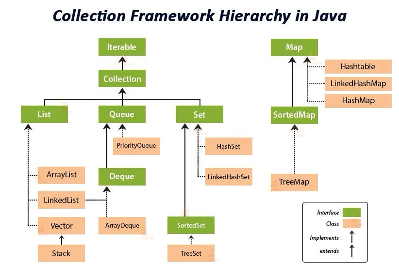

# 13. Collection Framework
## Collection 이란

> 목록성 데이터를 처리하는 자료 구조
>
- 자료구조 : 어떤 정보를 담는 것을 의미, 여러 데이터를 담을 때 사용한다.
    - 배열, 스택, 큐, Set, Map 등
- 자바 Collection 유형 : List, Queue, Set, Map



## Collection 인터페이스

자바 Collection에 가장 기본 뼈대가 되는 인터페이스로 LIst, Queue, Set에 상위 인터페이스이다.

- Collection은 Iterable 인터페이스를 확작하는데, Iterable은 Iterator<T> 타입을 return하는 메소드 iterator() 하나가 존재한다.
  `Iterator<T> Iterator()`

### Collection 선언 메서드

| **메소드 시그니처** | **반환** | **설명** | **비고** |
| --- | --- | --- | --- |
| size() | int | 원소 개수 반환 |  |
| isEmpty() | boolean | 비어있는지 여부 |  |
| contains(Object o) | boolean | 특정 원소 포함 여부 | equals() 기준 |
| toArray() | Object[] | 배열로 변환 |  |
| toArray(T[] a) | T[] | 타입 지정 배열로 변환 | 배열 크기/타입 처리 규칙 있음 |
| add(E e) | boolean | 원소 1개 추가 | 실패 시 false 또는 UnsupportedOperationException |
| addAll(Collection<? extends E> c) | boolean | 다른 컬렉션 원소 모두 추가 | 변경 발생 시 true |
| remove(Object o) | boolean | 특정 원소 1개 제거 | equals() 기준 |
| removeAll(Collection<?> c) | boolean | c에 포함된 원소 전부 제거 |  |
| removeIf(Predicate<? super E> filter) | boolean | 조건 만족 원소 제거 | Java 8 default |
| retainAll(Collection<?> c) | boolean | c에 포함된 원소만 남김(교집합 유지) |  |
| clear() | void | 전체 제거 |  |
| equals(Object o) | boolean | 동등성 비교 | Object 메소드지만 컬렉션 구현체가 의미를 부여 |
| int hashCode() | int | 해시코드 | Object 메소드지만 컬렉션 구현체가 의미를 부여 |
| containsAll(Collection<?> c) | boolean | c의 원소를 모두 포함하는지 |  |
| Stream<E> stream() | Stream<E> | 순차 스트림 생성 | Java 8 default |
| Stream<E> parallelStream() | Stream<E> | 병렬 스트림 생성 | Java 8 default |
| Spliterator<E> spliterator() | Spliterator<E> | spliterator 반환 | Java 8 default |

### Iterator 인터페이스

반환 값인 Iterator 인터페이스가 있어 Collection은 데이터를 순회할 수 있다.

- hasNext() : 추가 데이터 여부 확인 메소드
- next() : 현재 요소 반환 후 다음 요소로 이동
- remove() : 데이터 삭제 메소드

## List 인터페이스

List는 배열과 비슷한 순서가 있는 인터페이스이다.

- List를 구현한 대표적인 클래스는 ArrayList, Vector, Stack, LinkedList가 있다.

### ArrayList와 Vector

두 클래스는 “확장 가능한 배열”로 사용법과 기능이 거의 비슷하다.

**Vector**

- JDK 1.0부터 존재했다.
- Thread Safe하다
- Thread Safe해서 성능 이슈가 있다.
- 요새는 사용하지 않는다. (레거시)
- Vector를 구현한 Stack 클래스가 하위로 존재한다.

**ArrayList**

- JDK 1.2에서 추가되었다.
- Thread Safe하진 않지만 빠르다.

### ArrayList와 Vector는 배열을 사용한다.

ArrayList와 Vector는 `Object[]` 배열을 사용한다. 내부적으로 배열을 사용하지만, 두 컬렉션은 가변적으로 사용할 수 있다. 하지만 방식에 차이점이 있다.

```java
transient Object[] elementData; // non-private to simplify nested class access
```

**ArrayList**

- 기본 생성 시 빈 배열로 시작
  `private static final Object[] DEFAULTCAPACITY_EMPTY_ELEMENTDATA = {};`
- 첫 add()시 기본 10으로 확장
- 용량 증가 방식 : 1.5배씩 증가

```java
newCapacity = oldCapacity + (oldCapacity >> 1);
```

- 확장시 더 큰 배열 생성
    - System.arraycopy() 호출
    - 기존 배열 참조 교체
    - O(n)

> **System.arrayCopy()**
JVM이 직접 최적화하는 네이티브 레벨 메모리 복사 연산
대량 복사시 성능 차이가 매우 크다.
> - 빠른 성능, overlap 해결, 타입 안정성, 얕은 복사
>

**Vector**

- 처음부터 크기 10 배열 생성
- 용량 증가 방식
    - capacityIncrement 지정된 경우 선형 증가

    ```java
    newCapacity = oldCapacity + capacityIncrement;
    ```

    - 지정되지 않은 경우 2배 증가

    ```java
    newCapacity = oldCapacity * 2;
    ```


### 배열 기반 구조 한계

1. 배열은 크기가 고정이라 Resizing 비용이 크다.
   공간이 부족하면 공간 확장을 위해서 더 큰 배열을 생성해야 한다.

   **순서**

    1. 더 큰 배열 생성
    2. 기존 원소 통째로 복사
    3. 참조 변경
- 다만 ArrayList grow 전략이면, 평균 비용은 amortized O(1)이다.

> **ArrayList Grow 1.5배 전략**
1.5배씩 늘어난 다면 기하급수 합의 성질이 된다.
n개를 담았을 때 마지막 복사량은 대략 n에 가깝고
그 이전 복사들의 총합도 결국 n을 크게 넘지 않는다.
>
1. 중간 삽입/삭제는 이사가 필요하다.
    - 배열은 중간 삽입시 원소들을 뒤에 밀거나 당겨야 한다.
    - 중간 삽입 : System.arraycopy()로 뒤쪽 O(n) 이동
    - 중간 삭제 : O(n) 이동
2. 연속 메모리 요구 → 큰 배열에서 할당 실패/단편화 리스크
    - 배열은 연속된 메모리 블록이 필요하다. 그래서 힙이 쪼개져 있거나 큰 연속 공간이 없다면 여유 메모리는 있어도 큰 배열 할당이 실패할 수 있다.
    - GC/힙 정책에 따라 대형 배열 처리도 까다로워진다.
3. 삭제 후 메모리 회수가 즉시 일어나지 않는다.
    - ArrayList는 삭제해도 size만 줄고, 내부 배열은 그대로 남는다.
    - 원소 참조만 null 처리되면 GC는 가능하지만, 배열 자체 크기는 유지된다.

그래서 ArrayList는 인덱스 접근, appen가 많은 경우, 순차 순회에서 많이 사용된다.

- 중간 삽입, 잦은 확장, 대형 배열 할당이 빈번할때는 고려

### Serialize, Cloneable, Iterable<E>, RandomAccess

| 인터페이스 | 설명 |
| --- | --- |
| Serialize | 직렬화 기능 |
| Cloneable | clone() 메소드 사용 가능 (마커 인터페이스) |
| RandomAccess | 빠른 임의 접근 가능함을 표시 (마커 인터페이스) |
| Iterable | 순서 탐색 기능 |

### JVM 동작방식

**예시코드**

```java
List<String> list = new ArrayList<>();
list.add("A");
String v = list.get(0);
```

**컴파일 단계**

1. 자바 소스 → 바이트 코드(.class) 생성
- list.add, list.get 호출은 바이트코드에서 보통 invokeinterface로 만들어짐
- 정적 타입 체크
    - 컴파일러는 list의 타입을 List<String>으로 본다.
    - add, get 같은 List에 선언된 메소드만 호출 가능하도록 체크
- 메모리 위치
    - 컴파일에는 JVM 런타임 메모리 사용 단계가 아님

**클래스 로딩/링킹/초기화 단계**

프로그램이 실행되면 JVM은 필요할 때 다음을 로딩

- java/util/List
- java/util/ArrayList
- 내 패키지 클래스

각 클래스에 대해 로딩,링킹,초기화가 이루어짐

**Loading**

- 위에 클래스들을 로딩
- 메모리 위치
    - Method Area : 클래스 메타데이터(필드/메소드 정보, 상수풀 등)
    - 상수풀 또한 클래스 단위 데이터라 Method Area 위치

**Linking**

- Verification : 바이트 코드 검증
- Preparation : static 필드 영역 준비(기본 값 세팅)
- Resolution : 심볼릭 참조를 실제 참조로 변환(상수풀)
    - 꼭 이 시점에 되진 않고, Lazy하게 동작할 수도 있음
- 메모리 위치
    - Method Area : 타입/메서드/필드 참조를 해석하기 위한 메타 구조 정리

**Initialization**

- static {} / static 필드 초기화 실행
- 메모리 위치
    - static 필드 값 자체는 Method Area 쪽에 속한 클래스 변수 영역

**객체 생성 - new ArrayList<>()**

1. ArrayList 클래스가 로드됐는지 확인(안 됐으면 2단계 수행)
2. 힙에 ArrayList 인스턴스 메모리 할당
3. 생성자 <init> 실행
4. 결과 참조를 로컬 변수 list에 저장

**메모리 위치**

- Heap
    - ArrayList 인스턴스 객체 생성
    - 내부 배열 elementData는 보통 처음에는 빈 배열 첫 add 때 할당되는 배열이 된다.
- JVM  Stack (현재 스레드의 스택 프레임)
    - 로컬 변수 슬롯에 list 참조(주소값)가 들어간다.
- PC Register
    - 현재 실행 중인 바이트 코드 위치를 가리킨다.

**list.add(”호출”) - 인터페이스 호출 → 실제 구현체 메소드 실행**

바이트 코드
`invokeinterface java/util/List.add`

**런타임 실행 순서**

1. 스택에서 list(this)를 꺼내서 실제 객체의 클래스가 무엇인지 확인
    1. ArrayList
2. List.add 계약을 만족시키는 실제 타켓 메서드를 결정
    1. ArrayList.add
3. 메소드를 실행하면서 필요하면 내부 배열 확장, 값 저장등을 한다.

**메모리 위치**

- JVM Stack
    - add 호출로 새 스택 프레임이 생김(매개변수, 로컬, operand stack 등)
    - 호출/복귀에 필요한 리턴 주소/프레임 링크도 스택 프레임에 들어감
- Method Area
    - ArrayList에 있는 add 메서드 바이트코드/메타데이터를 참조
    - 인터페이스 메소드 테이블/클래스 메타정보를 사용해서 디스패치(어느 메소드 실행할지) 판단
- Heap
    - 실제 데이터는 여기에 저장됨
    - elementData 배열이 없거나 꽉 찼다면
        - 새 배열 객체를 Heap 생성
        - System.arraycopy로 복사
        - elementData 참조를 새 배열로 교체
    - PC Register
        - 실행 위치 갱신

## Set

Set에 가장 큰 특징

- 중복 저장을 허용하지 않는다.
- 순서 예측 불가 (Linked Hash Set은 순서 보장)
- 정렬 불가능(TreeSet은 가능)
- 동기화 불가능
- 하위 클래스 : HashSet, TreeSet, LinkedHashSet

### HashSet

내부적으로 Hash Map을 사용한다.

```java
Set.add(e)
 → HashMap.put(e, PRESENT)
```

**JVM 메모리 구조**

```java
HashSet 객체
   ↓
HashMap 객체
   ↓
Node[] table (배열)
   ↓
Node(key, value, hash, next)
```

즉, Set은 사실상 Key만 사용하는 HashMap

**특징**

- 빠른 검색 속도
- equlas, hashcode로 중복을 판단
- 정렬 x, 순서 x

### LInkedHashSet

Hash Set과 LInked List를 함께 사용하여 순서 추적

HashMap + Entry(prev, next) 구조

```java
Node (hash bucket 체인)
 + before / after 포인터 (이중 연결 리스트)
```

- 정렬 x, 순서 o, 중복 x

### TreeSet

이진 탐색 트리 (Red-Black Tree) 구조를 사용

```java
TreeMap
   ↓
Entry
   - key
   - left
   - right
   - parent
   - color
```

- 정렬 o, 순서 o, 중복 x
- 정렬 기준은 Comparable.compareTo 메소드를 따른다.
- Comparator 구현도 가능
- 시간 복잡도 O(log n)

>
>
>
> HashSet은 내부적으로 HashMap을 사용합니다.
> Set은 value가 필요 없는 Map의 특수 형태이기 때문에 key를 HashMap의 key로 저장하고, value에는 단일 더미 객체를 사용합니다.
> 이렇게 하면 해시 계산, 충돌 처리, 리사이즈 등의 복잡한 로직을 재사용할 수 있고, 상속이 아니라 합성을 사용해 API 계약을 분리했습니다.
> 결과적으로 HashSet은 HashMap 위에 얇게 올라간 구조입니다.
>

### EnumSet

EnumSet은 enum만 저장 가능하다.

```java
enum Role {
    ADMIN, USER, GUEST
}

EnumSet<Role> roles = EnumSet.of(Role.ADMIN, Role.USER);
```

**특징**

- enum 타입만 저장 가능
- 매우 빠름
- 메모리 사용량 적음
- 순서 보장

**필요한 이유?**

- EnumSet은 Hash를 사용하지 않고, 비트 마스크 기반
- enum 타입 집합이 필요할 때
- 권한 관리
- 상태 플래그
- 옵션 조합

**Ordinal 이용해 비트 마스크?**

```java
bit2 bit1 bit0
GUEST USER ADMIN
0 1 1
```

ADMIN, USER만 Enum Set에 존재한다고 했을때

```java
elements = 0b011   (long 한 개)
```

## Map

Map<K, V>는 Key → Value 관계를 저장하는 자료구조

```java
Map<String, Integer> map = new HashMap<>();
map.put("A", 1);
```

- Key는 중복 불가
- Value는 중복 가능
- 순서 보장 여부는 구현체마다 다름
- Colliction 인터페이스를 구현하지 않는다.
- 종류 : HashMap, LinkedHashMap, TreeMap, Hashtable, ConcurrentHashMap, EnumMap, WeakHashMap

**Map이 Collection과 다른 이유**

1. Collection은 요소들의 집합이다.
2. Map은 키-값 관계로 추상화가 다른다.

**예시**

- 캐시
- 조회 테이블
- 그룹핑
- 카운팅
- 인덱스 역할

### HaspMap

```java
static class Node<K,V> {
    final int hash;
    final K key;
    V value;
    Node<K,V> next;
}
```

**동작 과정**

1. key.hashCode()
2. hash를 재가공
3. index = hash % table.length
4. 버킷 탐색
5. equlas 비교

### **LinkedHashMap**

HashMap + 이중 연결 리스트

```java
hash, key, value, next
+ before, after
```

- put 순서 유지

### TreeMap

Red-Black 트리 기반

```java
Entry
 ├─ key
 ├─ value
 ├─ left
 ├─ right
 ├─ parent
 └─ color
```

- 정렬 유지

### **ConcurrentHashMap**

- 세그먼트 기반 (JDK 7)
- CAS + synchrnized 조합 (JDK 8+)
- 멀티스레드 환경 최적화

### equals / hashCode 중요성

HashMap의 성능은 거의 전적으로

- hashCode 품질
- equals 정확성

두 가지가 중요

다음을 주의해야 한다.

- 충돌 폭증
- 성능 저하
- 키 중복 인식 실패

## Queue

FIFO 구조의 컬렉션 인터페이스이다.

```java
Queue<String> queue = new LinkedList<>();
queue.offer("A");
queue.poll();  // A
```

### LinkedList

```java
Node
 ├─ item
 ├─ prev
 └─ next
```

**특징**

- 삽입/삭제 O(1)
- 랜덤 접근 O(n)
- 객체 생성 많음 → GC 부담

### ArrayDeque (원형 배열 기반)

```java
Object[] elements
int head
int tail
```

**특징**

- 원형 버퍼 방식
- 양쪽 삽입/삭제 O(1)
- 객체 생성 적음
- 대부분 상황에서 LinkedLIst보다 빠름

### PriorityQueue

```java
Object[] heap
```

- 내부는 최소 힙으로 구현
- 정렬 순서로 poll()

| **연산** | **시간** |
| --- | --- |
| offer | O(log n) |
| poll | O(log n) |
| peek | O(1) |

### **ConcurrentLinkedQueue**

- Lock-free
- CAS 기반
- non-blocking
- 멀티스레드 환경에서 사용

> **Lock-free**
락 없이도 여러 스레드가 안전하게 진행되는 알고리즘
>

> **CAS (Compare-And-Swap)**
현재 값이 내가 예상한 값과 같으면, 새 값으로 바꾸는 연산 방식
>

## 버전별 Collection Framework 특징 정리

### **Java 1.2 (Collections Framework 도입)**

- **새로 도입(대표)**: ArrayList, LinkedList, HashSet, TreeSet, HashMap, TreeMap
- **레거시 통합**: 기존의 Vector, Hashtable 등이 컬렉션 프레임워크 인터페이스와 호환되도록 정비됨
    - “표준 인터페이스 + 구현체” 체계가 여기서 시작

### Java 1.4

- LInkedHashMap, LinkedHashSet 추가

### Java 5

- ConcurrentHashMap 등 동시성 컬렉션이 표준 컬렉션으로 자리 잡음
- EnumSet, EnumMap 추가
- PriorityQueue 추가
- 제네릭 타입으로 안정성 강화

### Java 6

- ArrayDeque 추가

### Java 8

- 구현 변경 : HashMap 충돌 버킷 커질 때 트리화
- 동시성 성능 개선
- Stream API 대응으로 default 메소드 추가
    - 단순 컨테이너 → 파이프라인 소스 역할까지 하게 됨

### Java 9

- 불변 컬렉션 팩토리 메서드 추가
    - null 불가, Map(중복 키 불가), 변경 불가

### Java 10

- 불변 컬렉션 copy 추가
- Stream에 불변 컬렉션 기능 추가

### Java 21

- Sequenced Collections 도입
- 순서 있는 컬렉션을 공통 인터페이스로 묶음
    - getFirst, GetLast, reveresed 등 순서 기능 컬렉션을 다루기 쉬어짐

---

## 출처

- https://moon-97.tistory.com/181
- https://coding-factory.tistory.com/556
- 책 - 자바의 신