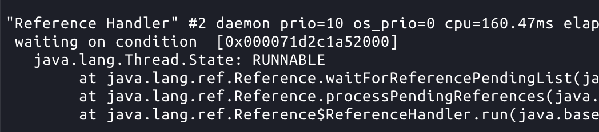
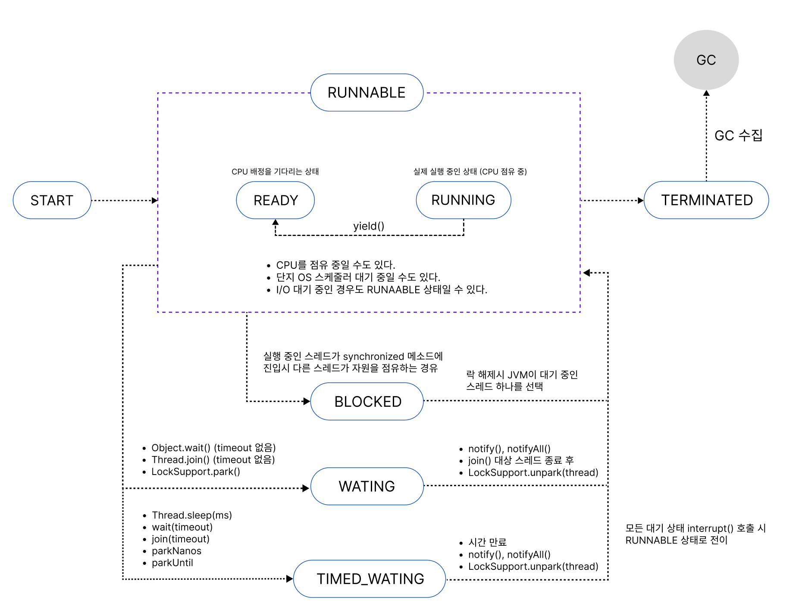

# 14. 자바의 쓰레드

자바에서는 쓰레드를 동작하기 위한 Runnable 인터페이스와 Thread 클래스가 있다.

자바의 쓰레드에 대해서 알아보기 전에 Thread의 개념부터 정의해보자.

## Thread란?

처음엔 보통 프로세스와 쓰레드를 혼동하기 쉽다. 하지만 명확하게 프로세스가 쓰레드 보다 상위이다. 프로세스는 프로그램을 실행하는 단위이고, 쓰레드는 그 실행 단위안에서 실행 흐름을 나눈 단위이다.

많이 드는 예시로는 프로세스는 하나의 식당을 의미하고, 쓰레드는 그 안에서 일하는 직원을 의미한다.

- 프로세스인 식당은 독립된 공간(주방/창고/홀/주문 시스템)을 가지고 있다.
- 쓰레드는 그 공간에서 잡업을 수행하는 일꾼이다.

그래서 프로세스는 프로세스마다 독립된 공간을 가지고, 쓰레드는 그 독립된 공간을 공유하며 동작한다.

### Thread가 만들어진 이유

초기 시스템은 단일 흐름으로 동작하는 방식이었다.

- 한 번에 하나의 프로그램만 실행 가능
- 1개 CPU
- 실행 흐름도 하나

그래서 I/O 대기 동안 CPU가 동작하지 않아서 유휴 상태가 길어지는 현상이 생김.

→ CPU가 일을하지 않고 쉬는 시간

그 시간동안 자원을 낭비하는 것이기 때문에 이를 해결하기 위해 멀티 태스킹, 멀티 프로세싱이 나왔다.

> 멀티 태스킹은 (동시성)
하나의 CPU에서 여러 작업을 “시간 분할”로 번갈아 실행하는 방식
>

이를 통해 사용자 체감 동시성 확보 CPU 활용도가 증가 했다.

하지만, 다음과 같은 문제점이 아직 존재했다.

- IPC 비용 발생
- 컨텍스트 스위칭 비용 발생

> 멀티 프로세싱 (병럴성)
여러 CPU 코어에서 여러 프로세스를 동시에 실행
>
- 프로세스간 메모리 공유 불가
- 통신 비용
- 데이터 공유 구조 비효율

스레드가 해결한 문제

- 스레드는 프로세스 내인 같은 주소 공간을 공유하기 때문에 컨텍스트 스위칭 비용을 감소시켰다.
- 같은 메모리 공간을 공유하기 때문에 멀티 코어에서 IPC 없이 데이터 공유가 가능해졌다.

즉, 스레드 도입으로 다음과 같은 이점을 얻었다.

- CPU 활용 극대화
- 응답성 향상
- 병렬 처리 지원
- 프로세스간 통신 비용 제거

멀티태스킹이 시간 분할을 통해 동시성을 제공하고, 멀티프로세싱이 다중 코어 기반 병렬성을 제공했다면, 스레드는 동일한 주소 공간 내에서 경량 실행 단위를 제공함으로써 두 모델의 자원 활용 한계를 보완하기 위해 도입되었다.

## 자바 메인 스레드

```java
public static void main(String[] args) {
}
```

자바는 main 메소드가 실행되면서 하나의 스레드가 시작되는데 이것을 메인 스레드라고 한다.

- 메인 스레드는 자바 실행과 동시에 실행된다.
- 모든 자바 애플리케이션에 최소 1개 이상의 스레드를 가진다.
- 메인 스레드가 멈추면 프로그램 전체가 멈추게 된다.
- 메인 메소드가 정상 종료되거나 return을 만나게 되면 프로그램은 종료된다.
- 새로운 스레드를 생성하여 병렬 처리할 수 있다.
- 일반 스레드는 메인 스레드가 종료되어도 남아있을 수 있다. 데몬 스레드는 함께 종료된다.

자바 메인 스레드가 생성되면, JVM은 해당 스레드만을 위한 고유한 JVM스택 영역을 메모리에 생성한다.
JVM 스택에는 메서드 호출, 지역 변수, 임시 결과 등을 저장하며, 힙 영역에 생성된 객체의 참조값을 가지고 있다. 또한, 이 스레드는 메서드 영역과 힙 영역을 다른 스레드와 공유하며 사용하게 된다.

즉, 자바는 메인 스레드를 필두로 필요하면 여러 스레드를 생성하여 프로그램을 동작을 담당하게 된다.

## Runnable 인터페이스, Thread 클래스

자바에서 스레드 제어는 Runnable, Thread를 통해 할 수 있다. 스레드는 Java 1.0부터 존재했지만, 동시성 API의 본격적인 체계화는 Java 5 부터라고 보면 된다.

**초기 (Java 1.0 ~ 1.4)**

- java.lang.Thread
- java.lang.Runnable
- Object.wait/notify/notifyAll
- Thread.sleep/join/interrupt
- Thread.stop/suspend/resume

> Thread.stop/suspend/resume 등은 위험해서 사실상 사용 금지
>

### Runnable

Runnable은 인터페이스로 실행할 작업 자체를 표현하는 함수형 인터페이스이다.

- 핵심 메서드 : void run()
- 특징
  - 스레드 생성/관리 책임은 없다.
  - 작업과 실행을 분리해서 재사용/테스트/조합이 쉬움
  - ExecutorService 같은 프레임워크와 조합해여 사용하기 좋다.

즉, Runnable은 스레드는 아니다. 실행 단위이다.

> **실행 단위**
실행 단위는 CPU에 의해 스케줄링되어 실제로 수행되는 최소 작업 단위이다.
운영체제에서 실제 스케줄링 대상은 스레드다.
>

### Thread

Thread는 실행 컨텍스트를 생성하고 OS 스레드와 매핑되는 실행 주체이다.

- 새로운 호출 스택 생성
- OS 네이티브 스레드와 1:1 매핑 (HotSpot 기준)
- 스케줄링은 운영체제에 위임
- run()을 직접 호출하면 멀티스레드가 아니다.
  - run() : 스레드가 수행되는 작업
  - start() : 스레드를 시작하는 메소드

```java
public class Thread implements Runnable {
    private Runnable target;
}
```

Thread는 내부적으로 Runnable을 보유할 수 있다. (상속보다 위임)

**제공 메소드**

- sleep
  - 현재 쓰레드 멈추기
  - 자원을 놓지 않고, 제어권을 넘겨줌
  - 데드락 발생 가능
- interrupt
  - 다른 쓰레드를 깨워서 interruptedException 발생시킴
  - Interrupt가 발생한 스레드는 예외를 catch하여 다를 작업 수행 가능
- join
  - 다른 스레드의 작업이 끝날 때 까지 기다림
  - 스레드의 순서 제어 가능

### Runnable과 Thread의 차이

```java
Runnable task = () -> System.out.println("Hello");
task.run();  // 그냥 메서드 호출
```

```java
Thread t = new Thread(task);
t.start();
```

Runnable과 Thread의 차이는 run과 start이다. 위에 설명했듯이 Runnable로 run만 호출하면 일반 메소드 호출과 똑같다. 그래서 Thread 생성시 Runnable을 넘기고 Thread 내에서 start를 해야 새로운 스레드가 작업하게 된다.

- Runnable은 Task를 정의
- 실제 실행은 Thread로 가능

### 설계 관점 차이

```java
class MyThread extends Thread {
    public void run() { }
}
```

스레드는 상속받아 스레드 클래스를 만들어 사용할 수 있다. 하지만, 상속의 문제점으로 인해 보통 이렇게 사용하지는 않는다.

- 실행과 작업이 강결합
- 재사용성 낮음
- 실행 전략 변경 어려움

그리고 스레드를 직접 생성해 사용하면 다음과 같은 문제점이 있다.

- 스레드 수 상한이 없다. 즉, 계속해서 생성할 수 있다.
- 스레드가 많아지면,
  - 컨텍스트 스위칭 증가
  - CPU 캐시 효율 저하
  - OOM 위험 증가
- 실행 정책이 없어 관리가 불가하다.

  스레드 사용은 운영체제 자원을 직접적으로 소모하므로, 적절한 실행 정책이 수반되지 않으면 애플리케이션에 심각한 성능 및 안정성 문제를 초래할 수 있다.

  - 스레드 이름/우선순위/데몬 여부
  - 예외 처리 전략
  - 재시도/타임아웃/취소
  - 결과 수집
  - 거절 정책
  - 리소스 관리

그래서 Executor + Runnable 조합으로 실행 및 관리는 프레임워크에 위임하고, Runnable로 작업만 정의해서 사용한다.

### Runnable 작업 단위 사용 예시

```java
public class IndependentTask implements Runnable {

    private int localCount = 0;

    @Override
    public void run() {
        for (int i = 0; i < 1000; i++) {
            localCount++;
        }
        System.out.println(localCount);
    }
}
```

```java
Runnable task = new IndependentTask();

ExecutorService pool = Executors.newFixedThreadPool(2);
pool.submit(task);
```

Runnable을 구현한 작업 단위 클래스를 정의 및 객체 생성하여 ExcutorService에 등록하면 ExceutorService가 내부 실행 전략에 맞춰서 스레드를 실행해준다.

### 데몬 스레드

**데몬 스레드(Daemon Thread)**는 사용자 작업을 직접 수행하기보다, 다른 스레드를 보조하는 역할을 한다. 그래서 모든 사용자 스레드가 종료되면 함께 종료되는 스레드이다.

**데몬 스레드의 적용 예시**

1. 워드프로세서의 자동 저장
2. 미디어 플레이어의 동영상 및 음악 재생
3. JVM 내부 데몬 스레드
  1. GC Thread
  2. Finalizer Thread
  3. Reference Handler
  4. Signal Dispatcher



```java
deamonThread.setDaemon(true)
```

데몬 스레드는 스레드를 생성하여 setDaemon(true) 설정을 하면 사용할 수 있다.

또한, isDaemon()으로 데몬 스레드인지 확인할 수 있다.

**주의할 점**

- start() 후 setDaemotn(true)시 IllegalThreadStateException이 발생한다.
- finally 블록 실행을 보장하지 않는다.
- 자원 정리를 보장하지 않는다.
- 파일/DB 정리 위험성이 있다.
- JVM 종료 조건으로 데몬 스레드는 포함되지 않는다.

따라서, 데몬 스레드는 사용자 스레드의 보조 역할만 수행해야 한다.

## Thread 상태

Thread는 6가지 상태가 존재한다.

- NEW, RUNNABLE, BLOCKED, BLOCKED, WAITING, TIMED_WATING, TERMINATED

```java
public enum State {
        NEW,
        RUNNABLE,
        BLOCKED,
        WAITING,
        TIMED_WAITING,
        TERMINATED;
}
```

Thread안에 enum 열거형으로 되어있는 State를 보면 각 상태마다 주석이 달려있다. 해석을 해보면,

- NEW : 스레드 객체는 생성되었지만 아직 start()가 호출되지 않은 상태
  - OS 스레드 생성 전
  - JVM 내부 실행 컨텍스트 미생성
- RUNNABLE : JVM에서 실행 중이지만, OS 자원을 기다릴 수 있다.
  - RUNNABLE은 두 상태를 포함한다.
    - Running (CPU에서 실제 실행 중)
    - Ready (CPU 배정을 기다리는 상태)
  - CPU를 점유 중일 수도 있다.
  - 단지 OS 스케줄러 대기 중일 수도 있다.
  - I/O 대기 중인 경우도 RUNAABLE 상태일 수 있다.
- BLOCKED : 모니터 락을 기다리는 상태
  - synchronized 블록/메서드 진입 시
  - 다른 스레드가 이미 해당 모니터를 점유 중일 때
- WAITING : 특정 동작이 일어나기를 무기한 대기
  - 발생 조건
    - Object.wait() (timeout 없음)
    - Thread.join() (timeout 없음)
    - LockSupport.park()
  - 누군가가 신호를 줘야 깨어난다.
  - 스스로 깨어나지 않는다.
- TIMED_WAITING : 시간 제한이 있는 대기 상태
  - 발생 조건
    - Thread.sleep(ms)
    - wait(timeout)
    - join(timeout)
    - parkNanos
    - parkUntil
  - WATING과 달리 시간이 지나면 자동 복귀
- TERMINATED
  - run() 메서드 종료
  - 예외 발생으로 종료
  - 더 이상 실행 불가
  - 해당 상태가 되면 더 이상 진행 불가하다. `IllegalThreadStateExcpetion`



- WATING, TIMED_WATING → TERMINATED
  - 직접적인 상태 전이는 없다.
  - 그렇게 보이는 것은 대부분 깨어난 직후 종료 / 프로세스 강제 종료
- BLOCKED에서 interrupt가 되지 않는 이유
  - interrupt는 대기 해제를 하는 동작
  - BLOCKED는 대기가 아닌 자원 점유 경쟁에서 밀려난 스레드 상태
  - 락이 해제 되지 않았는데 interrupt에 의해 깨어난다면? 정상적인 실행이 아님

### **Block 된 스레드를 보는 법**

Thread Dump 확인하기

1. **jstack 사용**

```java
jstack <pid>
or
jcmd <pid> Thread.print
```

```java
"Thread-1" #15 prio=5 os_prio=0 tid=0x00007f... nid=0x1a03 BLOCKED (on object monitor)
   at com.example.MyService.method(MyService.java:42)
   - waiting to lock <0x000000076b8c5e40> (a java.lang.Object)
   - locked <0x000000076b8c5e20> (a java.lang.Object)
```

## 깊게 파헤치기

### RUNNING 상태에 “자원을 점유한다”

RUNNABLE에서 자원을 점유하게 되는 경우 실제로 CPU를 할당받아 바이트코드를 실행 중인 상태를 의미한다.

- 스레드 전용 메모리(JVM Stack, PC Register, Native Stack) 활성화
  - 자원을 점유하게 되면 해당 스레드의 JVM Stack이 활성화 된다.
  - 현재 메서드의 Stack Frame이 실행 된다.
  - 현재 실행 중인 바이트코드 위치를 PC Register에 저장 한다.
- JVM이 OS에게 CPU 스케줄링을 요청한다.
- Heap 객체 읽기/쓰기 가능
- JIT 컴파일 코드 캐시 사용
- GC Root로서 참조 유지 (실행 중인 스레드의 JVM Stack이 GC Root가 됨)

### 스레드 구동 방식

자바 스레드 구동 방식을 설명하면 다음과 같다.

**단계별 정리**

1. 스레드 생성
  - 자바는 Heap에 Thread 객체를 생성한다.
  - 이 시점에 OS 스레드는 만들어지지 않는다.
  - Thread 상태는 NEW이고, 실행 컨텍스트는 만들어지기 이전이다.
2. start() 호출
  - start()는 내부적으로 JVM 네이티브 호출을 타서 OS에 스레드 생성을 요청하게 된다.
  - 그리고 OS 스레드에 연결될 자바 쪽 실행 컨텍스트를 준비한다.

   **스레드 구동을 위한 JVM에서 준비되는 것들**

  - JAVA Thread 와 OS Thread을 1:1로 매핑 한다.
  - 새 스레드의 스택 메모리 생성
  - 스레드용 PC 생성
  - 스레드 상태 전이 NEW → RUNNABLE
3. OS 스케줄링 단계
  - RUNNABLE 상태에서 스레드가 바로 시작되지는 않는다.
    - OS 스케줄러가 타임슬라이스를 줄 때 비로소 Running 상태가 된다.
  - Running 상태
    - OS 스레드가 CPU를 받으면 JVM 스레드 엔트리를 통해 최종적으로 run()이 호출된다.
4. 실행에 따른 상태 변화 (대기/멈춤)
  - 스레드는 실제 상황에 따라 상태 전이를 거친다.
  - BLOCKED
  - WATING / TIMED WATING
  - I/O 대기
5. 종료
  - run() 메소드가 종료 되면 스레드도 종료 된다.
  - 자바 상태는 TERMINATED
  - OS 스레드 리소스는 회수된다.

> **정리**
OS는 멀티태스킹으로 CPU 시간을 쪼개 여러 실행 단위를 번갈아 돌리고, 멀티코어에서는 병렬로도 실행합니다. 자바에서는 new Thread()는 힙에 객체만 만들고, start()를 호출해야 JVM이 OS 네이티브 스레드를 생성해 스케줄링 대상에 올립니다. 이후 OS 스케줄러가 타임슬라이스를 배분하면서 스레드가 실행되고, 코어가 여러 개면 여러 스레드가 실제로 동시에 병렬 실행됩니다. 실행 중에는 락 대기(BLOCKED), 조건 대기(WAITING), 시간 대기(TIMED_WAITING), I/O 대기 등으로 상태가 전환되고, run()이 끝나면 종료됩니다.
>

### JVM 스레드, OS 스레드

**OS 스레드**

운영체제가 관리하고, OS 스케줄러가 CPU에 배정하는 최소 실행 단위

- CPU 시간을 누구에게 줄지 결정
- 실행 중인 스레드를 멈추고 다른 스레드로 컨텍스트 스위칭
- sleep, I/O 대기, interrupt
- 커널 자원(스택, 스케줄링 구조체 등) 관리

**JVM 스레드**

JVM이 자바 실행 흐름을 표현하기 위한 논리적 스레드 개념이며, 실행을 위해 보통 OS 스레드에 매핑된다.

- JVM STACK 프레임 관리
- PC 관리 : 현재 실행 위치 (바이트코드/네이티브 전환 포함)
- Thread 상태 관리
- Safepoint 협조 (GC 같은 전역 잡업을 수행하기 위해 모든 스레드 일시 중지)
  - 강제 중지가 아닌 Safepoint 요청을 보내면 각 스레드는 안전한 위치에서 멈춤
- 인터럽트 플래그, ThreadLocal 같은 런타임 기능

### 메인 메모리와 작업 메모리

**메인 메모리**

모든 스레드가 공유하는 변수의 공식적인 값이 저장되는 영역

- Heap 객체의 필드
- static 변수
- 공유 변수

**작업 메모리**

각 스레드가 변수 값을 읽어와 임시로 보관하고 사용하는 영역

- 스레드 전용
- 레지스터 / CPU 캐시 / 스택에 존재할 수 있다.
- 다른 스레드는 직접 접근 불가

**JMM(Java Memory Model) 이 필요한 이유?**

멀티코어 환경에서 문제점 때문

- 각 CPU 코어가 자체 캐시를 가진다.
- 같은 변수를 각 코어가 따로 들고 있을 수 있다.

예시:

```java
boolean flag = false;

// Thread A
flag = true;

// Thread B
while (!flag) {}
```

이론상 B는 멈춰야 하지만 B가 자체적으로 false로 값을 가지고 있을 수 있다.

**메인 메모리와 작업 메모리 관계**

작업 메모리는

1. 메인 메모리에서 값을 가져온다.
2. 작업 메모리에서 연산
3. 변경 시 메인 메모리에 할당한다.

그럼 언제 가져오고 할당할까? (가시성 문제)

그래서 JMM은 단계별 규칙을 정의한다.

- read
- load
- use
- assign
- store
- write

### **가시성 문제를 해결하는 방법**

**volatile 키워드 사용**

```java
volatile boolean flag;
```

- 읽을 때 항상 메인 메모리에서 읽는다.
- 할당 시 즉시 메인 메모리에 반영
- 특정 재정렬 금지

**synchronized**

```java
synchronized(lock) { ... }
```

- 락 진입 시 → 메인 메모리 값 강제 로드
- 락 해제 시 → 변경 값 메인 메모리에 flush

**Lock / Atomic**

- CAS 기반 동기화
- 메모리 베리어에 포함

### **특정 재정렬**

컴파일러, JIT, CPU 는 성능을 위해
명령어 순서, 메모리 접근을 미루기도 한다.

이럴 경우 멀티 스레드에서 문제가 생긴다.

예시 : Double Checked Loking 깨짐

```java
class Singleton {
    private static Singleton instance;

    static Singleton getInstance() {
        if (instance == null) {
            synchronized (Singleton.class) {
                if (instance == null) {
                    instance = new Singleton();
                }
            }
        }
        return instance;
    }
}
```

**예상 동작**

1. 메모리 할당
2. 생성자 실행
3. 참조를 instance에 저장

**실제 동작**

1. 메모리 할당
2. 참조를 instance에 저장
3. 생성자 실행

이렇게 되면 부분 초기화된 객체를 관측하게 된다.

### I/O 대기 상태인 자바 스레드 상태

I/O 대기 상태인 자바 스레드는 **RUNNABLE** 상태이다.

그 이유는 I/O 작업은 JNI를 통해 C/C++로 작성된 코드를 호출하게 된다. 이 코드들은 Native Method Stack에서 관리하게 되는데, 이 영역은 OS 작업을 의미한다. 그래서 JVM은 이를 RUNNABLE로 볼 수 밖에 없다.

- JVM은 스레드가 JVM 코드 내부에서 명시적으로 wait/lock 중일 때만 WATING, BLOCKED 상태를 구분할 수 있고, 네이티브 코드에서는 상태를 파악할 수 없다.

## Thread Local

자바(Java)에서 멀티스레드 환경일 때, 각 스레드마다 독립적인 저장 공간(전용 보관소)을 할당하여 스레드 간 데이터 공유를 막고 고유한 값을 안전하게 보관·사용하는 기술 및 클래스이다.

즉, 스레드마다 공유 자원이 아닌 독립된 저장 공간을 부여한다는 것

**멀티 스레드 환경에서는 스레드간 공유시 발생하는 문제점이 있다.**

1. 전역 변수
2. 싱글턴으로 관리하는 빈 내부 필드
3. 캐시, Stateful한 컬렉션

Thread-Safe 하지 않는다면, 레이스 컨디션 문제가 발생할 수 있다.

문제를 해결하기 위해 `synchronized`, `ReentrantLock`, `CAS` 방법을 사용할 수 있지만,
이러한 방식도 성능 저하, 데드락, 설계 복잡도와 같은 문제점이 존재한다.

그래서 Thread Local을 통해 각 스레드마다 Thread 객체와 연결된 전용 저장 공간을 만들어 해결할 수 있다.

---

## 참조

- https://jaimemin.tistory.com/2479#google_vignette
- https://mangkyu.tistory.com/258
- 책
  - 자바의 신
  - JVM 밑바닥까지 파헤치기
- https://codegym.cc/ko/quests/lectures/ko.questmultithreading.level05.lecture03
- https://mangkyu.tistory.com/438 (I/O 대기에서 자바 스레드 상태)